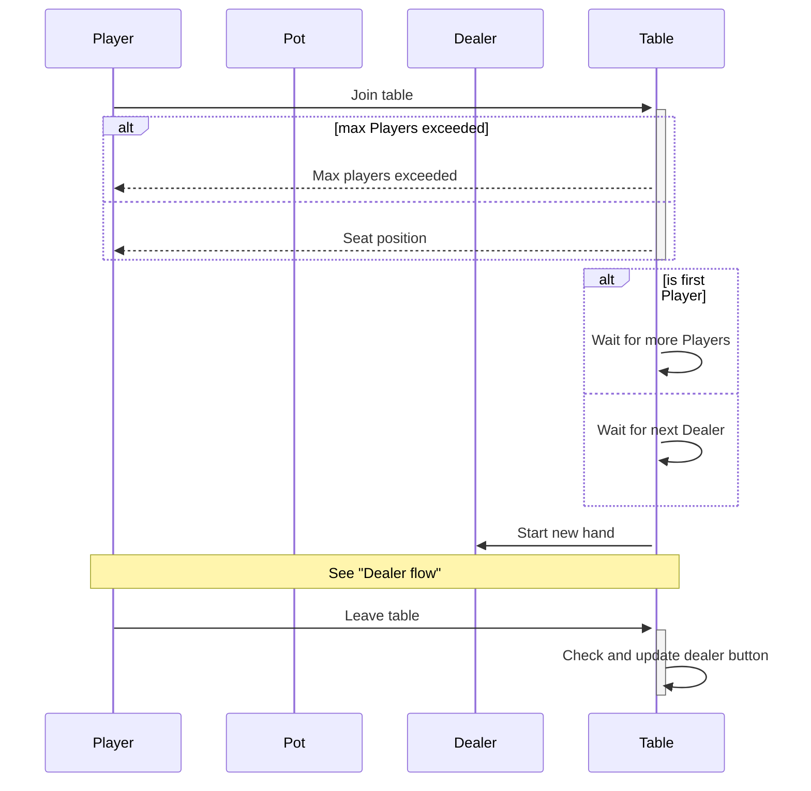
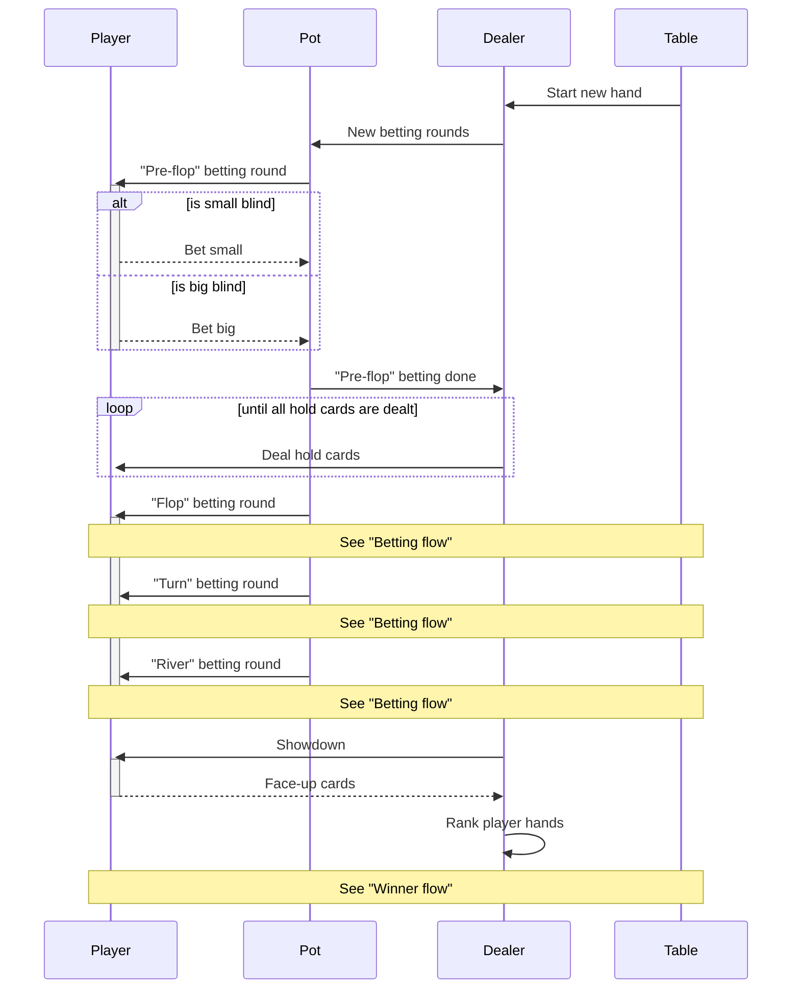
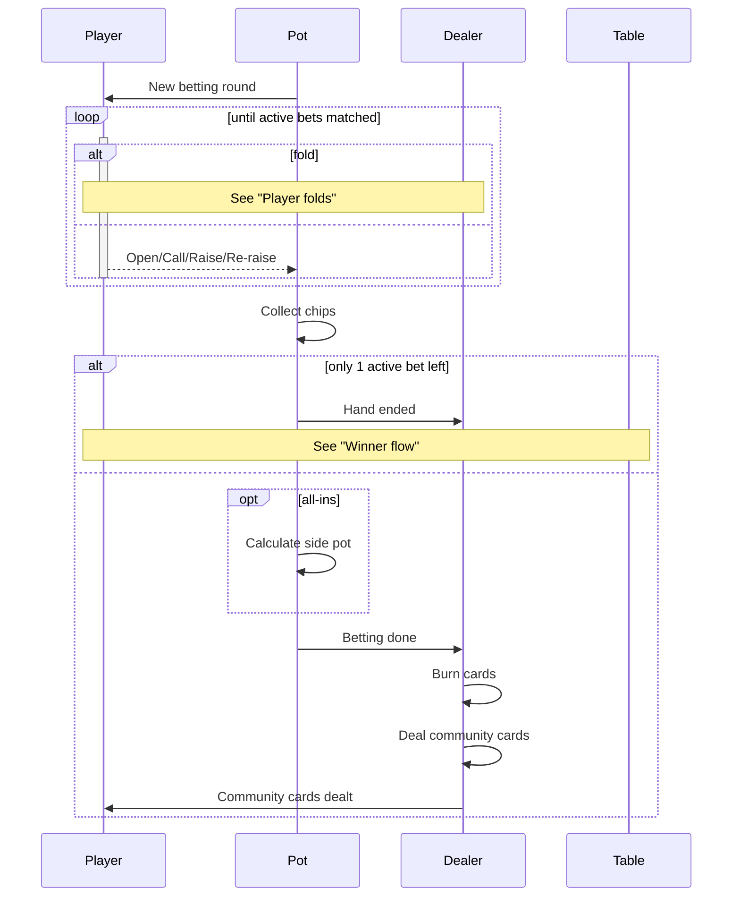
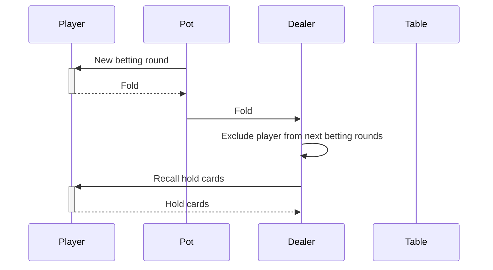
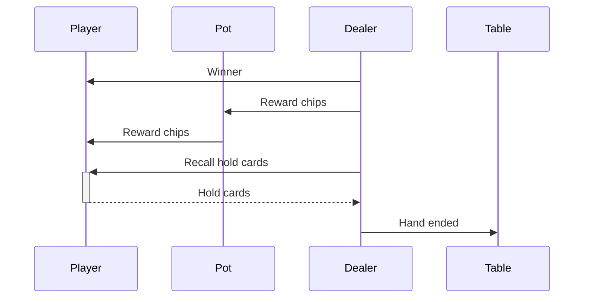

# Goker flows

- [Player flow](#player-flow)
- [Dealer flow](#dealer-flow)
- [Betting flow](#betting-flow)
- [Player folds](#player-folds)
- [Winner flow](#winner-flow)

## Player flow

## Dealer flow

## Betting flow

## Player folds

## Winner flow

