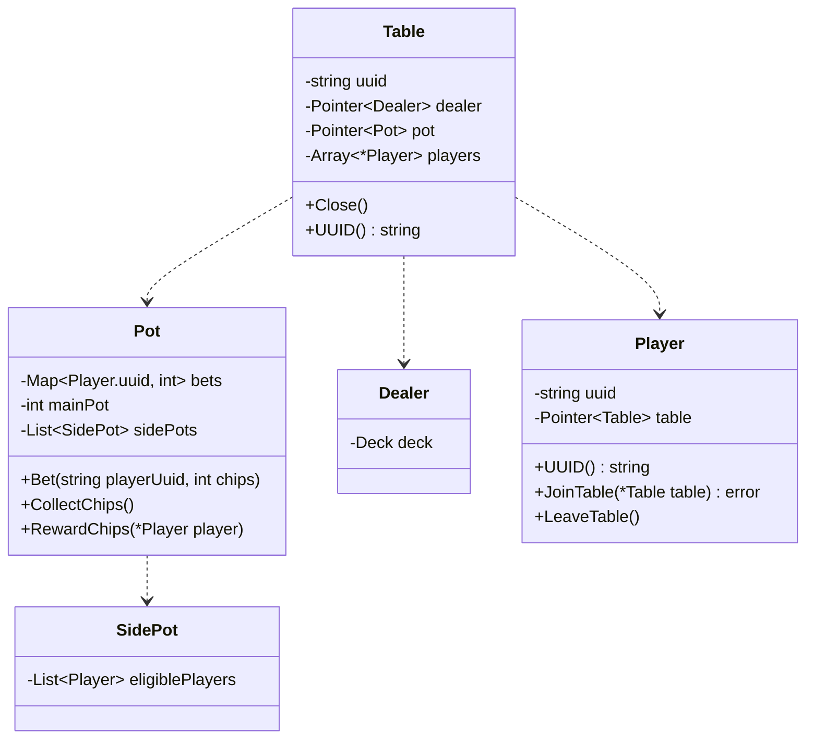

# Goker interfaces

```mermaid
classDiagram
    Table ..> Pot
    Table ..> Dealer
    Table ..> Player
    Pot ..> SidePot

    class Table {
        -string uuid
        -Pointer~Dealer~ dealer
        -Pointer~Pot~ pot
        -Array~*Player~ players

        +Close()
        +UUID() string
    }

    class Pot {
        -Map~Player.uuid, int~ bets
        -int mainPot
        -List~SidePot~ sidePots

        +Bet(string playerUuid, int chips)
        +CollectChips()
        +RewardChips(*Player player)
    }

    class SidePot {
        -List~Player~ eligiblePlayers
    }

    class Dealer {
        -Deck deck
    }

    class Player {
        -string uuid
        -Pointer~Table~ table

        +UUID() string
        +JoinTable(*Table table) error
        +LeaveTable()
    }
```
