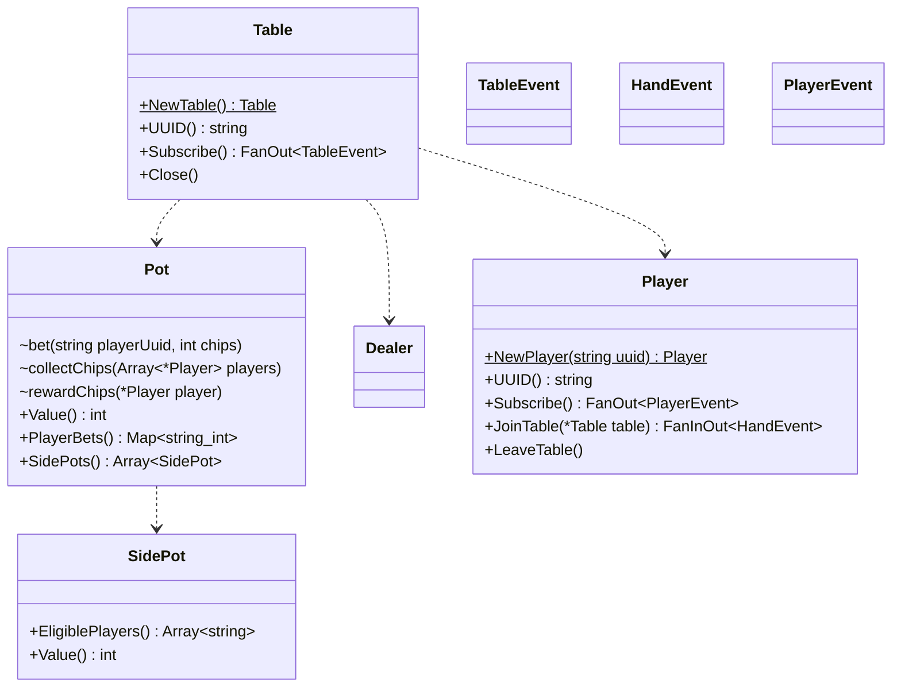

# Goker interfaces

```mermaid
classDiagram
    Table ..> Pot
    Table ..> Dealer
    Table ..> Player
    Pot ..> SidePot

    class TableEvent {

    }

    class HandEvent {

    }

    class PlayerEvent {

    }

    class Table {
        +NewTable()$ Table

        +UUID() string
        +Subscribe() FanOut~TableEvent~
        +Close()
    }

    class Pot {
        ~bet(string playerUuid, int chips)
        ~collectChips(Array~*Player~ players)
        ~rewardChips(*Player player)

        +Value() int
        +PlayerBets() Map~string_int~
        +SidePots() Array~SidePot~
    }

    class SidePot {
        +EligiblePlayers() Array~string~
        +Value() int
    }

    class Dealer {
    }

    class Player {
        +NewPlayer(string uuid)$ Player

        +UUID() string
        +Subscribe() FanOut~PlayerEvent~
        +JoinTable(*Table table) FanInOut~HandEvent~
        +LeaveTable()
    }
```
