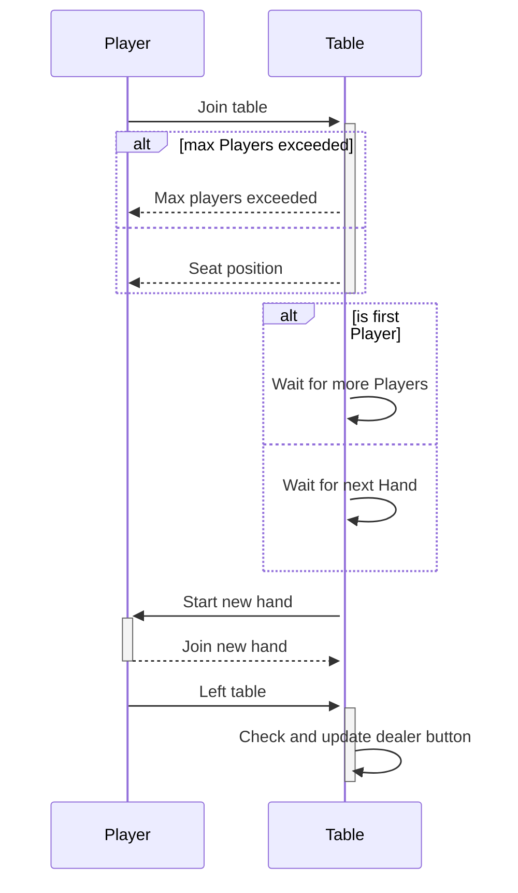
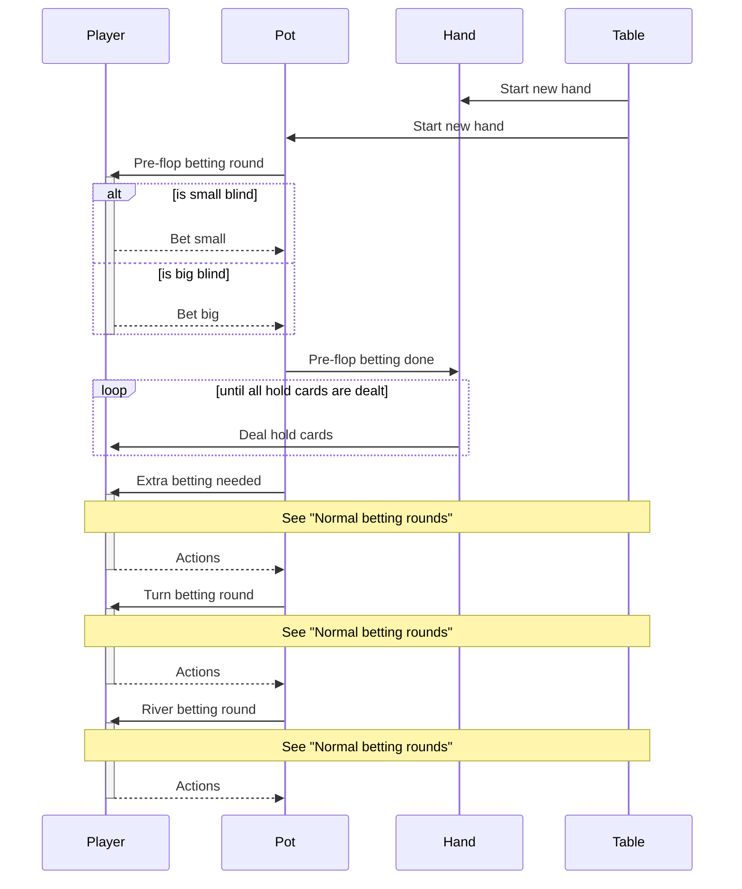
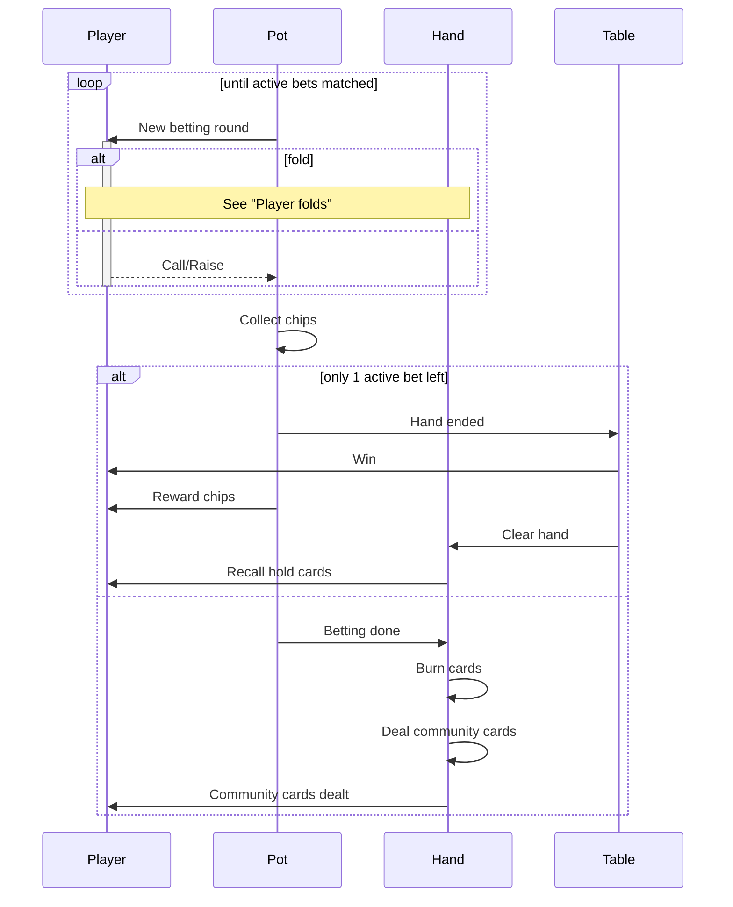
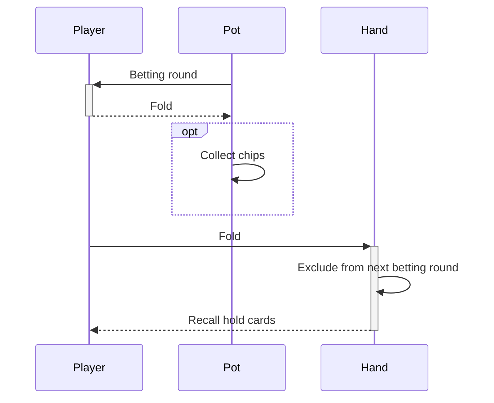

**Table of content**

- [Player joins and leaves table](#player-joins-and-leaves-table)
- [Hand interactions](#hand-interactions)
- [Normal betting rounds](#normal-betting-rounds)
- [Player folds](#player-folds)

# Player joins and leaves table

# Hand interactions

# Normal betting rounds

## Player folds

