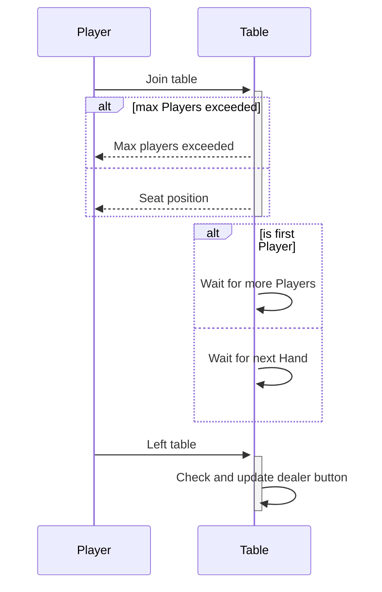

**Table of content**

- [Player joins and leaves table](#player-joins-and-leaves-table)
- [Hand interactions](#hand-interactions)

# Player joins and leaves table

```mermaid
sequenceDiagram
    participant Player
    participant Table

    Player->>+Table: Join table

    activate Table
    alt max Players exceeded
        Table-->>Player: Max players exceeded
    else
        Table-->>Player: Seat position
    end
    deactivate Table

    alt is first Player
        Table->>Table: Wait for more Players
    else 
        Table->>Table: Wait for next Hand
    end

    Player->>+Table: Left table
    Table->>-Table: Check and update dealer button
```

# Hand interactions
