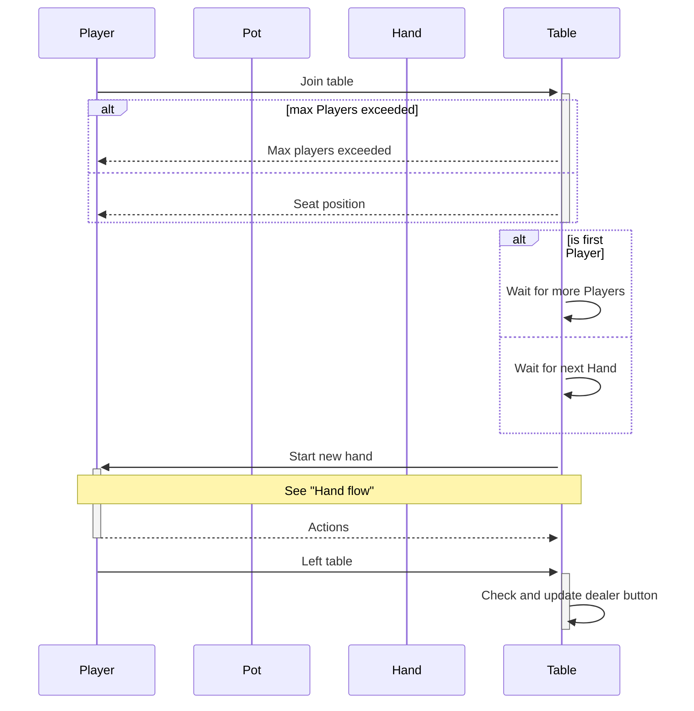
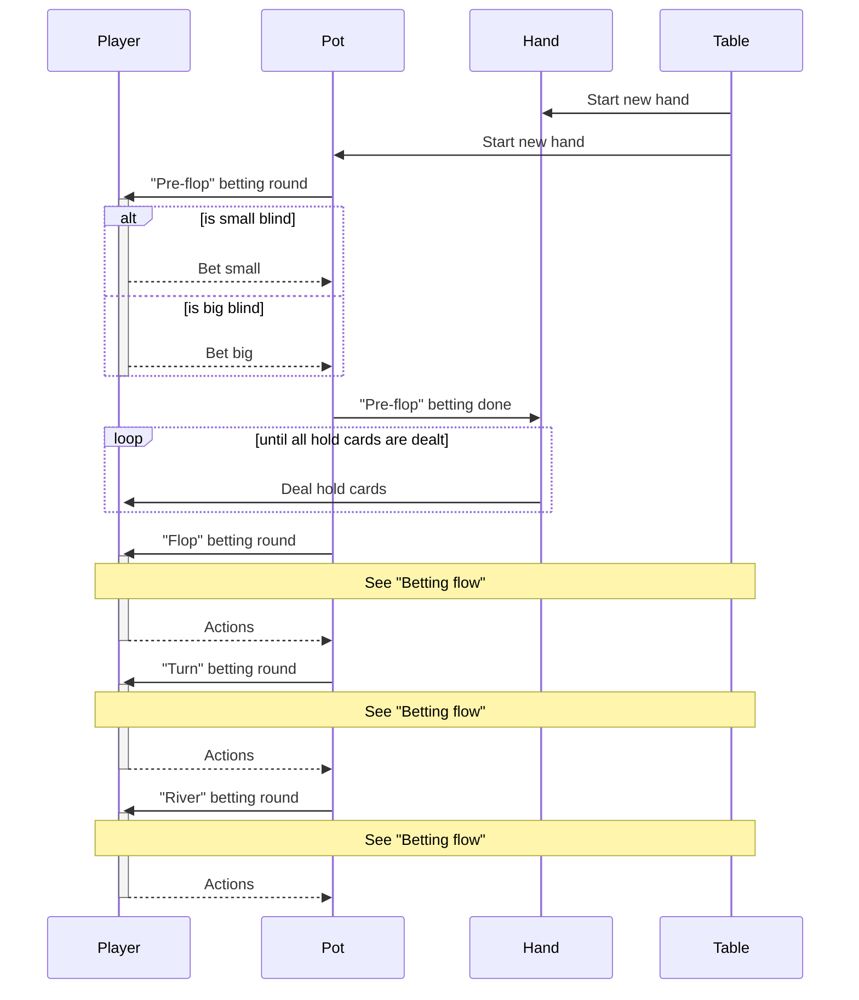
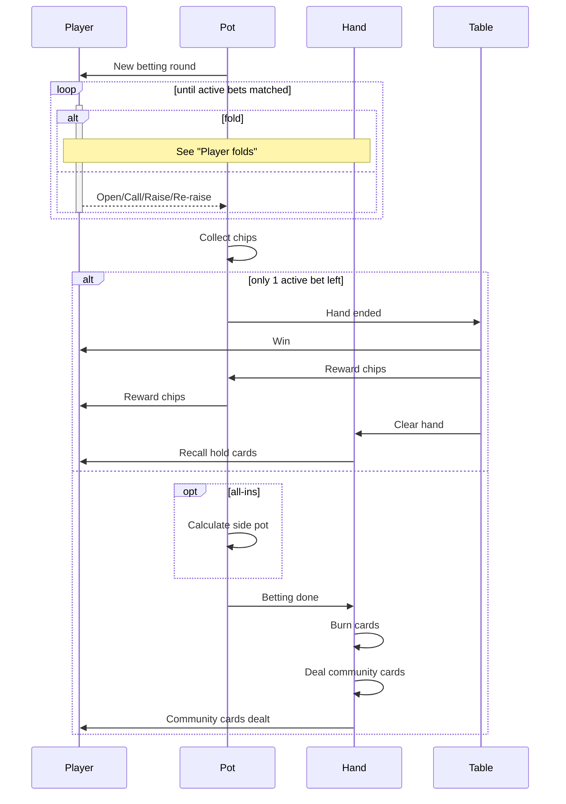
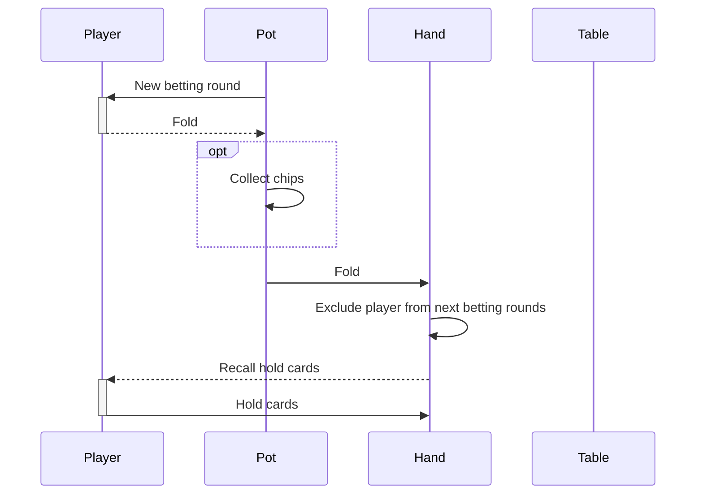

**Goker sequence diagrams**

- [Player flow](#player-flow)
- [Hand flow](#hand-flow)
- [Betting flow](#betting-flow)
- [Player folds](#player-folds)

# Player flow

# Hand flow

# Betting flow

## Player folds

